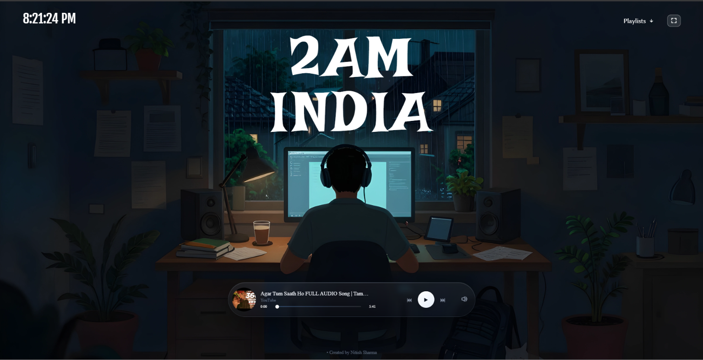

# 2AM INDIA

A modern React music player app that plays YouTube playlists with a sleek interface, custom playlist support, and fullscreen mode.

## Live Demo

Add your deployed link here:

- [Live Link](https://twoam-india.onrender.com/)

## Screenshot



## Features

- Play YouTube playlist music directly in the app
- Switch between default and custom playlists
- Add your own YouTube playlist URL
- Delete custom playlists from the UI
- Fullscreen toggle for better viewing experience
- Live time display and music controls
- Responsive and clean UI

## Tech Stack

- React
- Vite
- JavaScript
- YouTube IFrame API
- Boxicons

## Getting Started

### Prerequisites

- Node.js 18+
- npm or yarn

### Installation

```bash
npm install
```

### Run locally

```bash
npm run dev
```

Open the local URL shown in the terminal to view the app.

## Project Structure

```bash
src/
  App.jsx
  App.css
  components/
    MusicPlayer.jsx
    MusicPlayer.css
    Nav.jsx
  data/
    playlists.js
public/
  SS.png
```

## Usage

1. Open the app in the browser.
2. Choose a playlist from the navbar.
3. Paste a YouTube playlist URL in the playlist section to add your own.
4. Enjoy the music playback and toggle fullscreen when needed.

## Notes

This project uses the YouTube embedded player API, so playlist access depends on the public availability of the selected YouTube playlist.

## License

This project is for personal/demo use.
